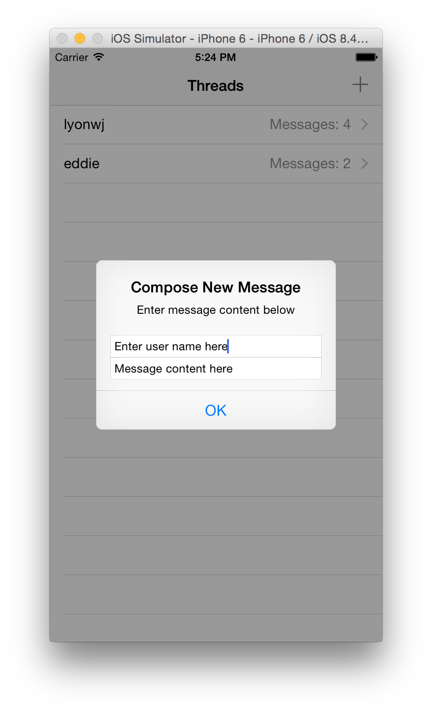

# messages-ios

Simple iPhone app for sending and receiving messages. Makes use of [messages-api](https://github.com/johnymontana/messages-ap)

## Dependencies

* Swift 1.2
* CocoaPods - makes use of `Alamofire` and `SwiftyJSON` libraries, however the `Pods` are included in version control so CocoaPods is not a requirement to build.

## Build

`open messages.xcworkspace`

Build and run with XCode

## Features

The UI is composed of two TableViews, one for displaying message threads and the other for displaying an individual conversation between two users.

### Threads TableView

### Conversation TableView

